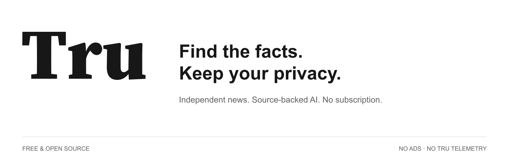
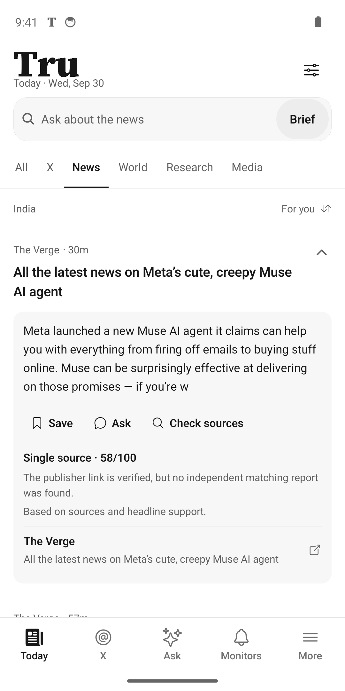
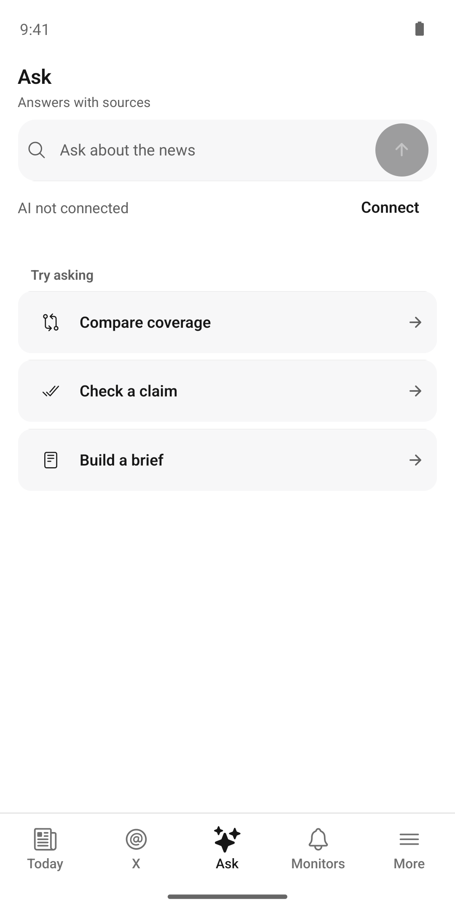
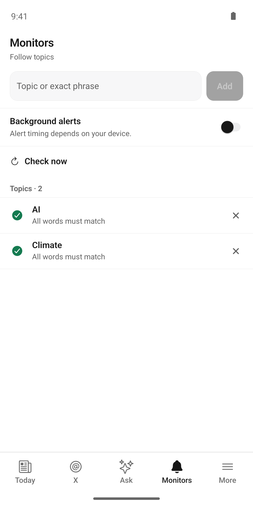
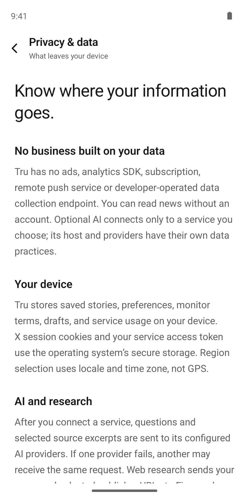
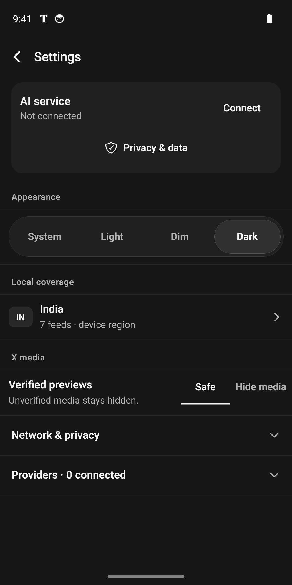
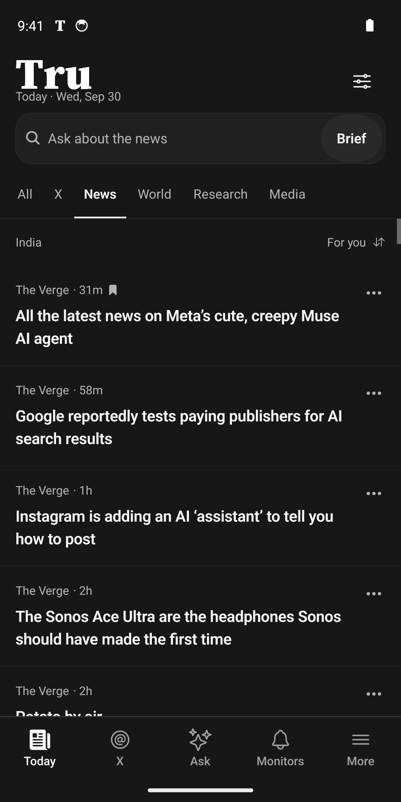
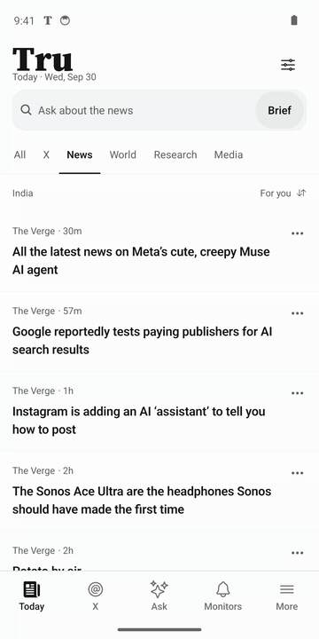
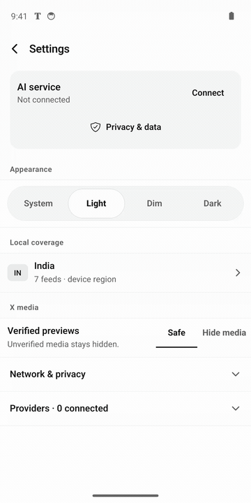

<p align="center">
  
</p>

<p align="center">
  <a href="https://github.com/debpalash/tru/releases/latest">Download Android</a> ·
  <a href="#see-tru">Screenshots &amp; demos</a> ·
  <a href="docs/PRIVACY.md">Privacy</a> ·
  <a href="docs/RELEASE.md">Self-host AI</a> ·
  <a href="https://github.com/debpalash/tru/issues">Support</a>
</p>

AI-generated noise is everywhere. **Tru brings you back to the reporting.** Read
original sources, compare independent coverage and use AI to research questions
with citations you can inspect. Evidence comes first; AI is an assistant.

**Free. Open source. No ads. No subscription. No Tru telemetry.**

## Get Tru

Download an APK from the [latest release](https://github.com/debpalash/tru/releases/latest).
Android **7.0 or newer** is required. Choose **universal** when unsure, or a smaller
build for your device:

| APK | Devices |
| --- | --- |
| Universal | All four supported architectures |
| ARM64 (`arm64-v8a`) | Most current phones and tablets |
| ARMv7 (`armeabi-v7a`) | Older 32-bit ARM devices |
| x86 / x86_64 | Intel Android devices and emulators |

Every release includes matching source, licenses, signature information and
SHA-256 checksums. The AAB is for store distribution, not direct installation.

You can also follow the official GitHub repository in **Obtainium**. See
[distribution channels](docs/DISTRIBUTION.md) for configuration and submission
status. Catalog badges are added only after a listing is accepted.

## Built for reading, backed by sources

- **A quiet daily feed.** Headlines, publisher and time first. Expand a story for
  context, citations, saving and research.
- **Compare coverage.** Source provenance and closely aligned headlines support
  deterministic evidence scores. Smart mix groups matching reports; Latest keeps
  individual stories.
- **Ask with citations.** Optional AI uses supplied sources. Explicit web research
  searches trusted publisher domains; unavailable web research falls back to the
  loaded feed with a clear label.
- **Keep what matters.** Save stories to your local library, follow world coverage
  and create topic monitors with device-only alerts.
- **Your reading environment.** Light, dark and dim themes, accessible controls
  and compact layouts.
- **Optional private routes.** Tor and relay controls for supported requests, with
  no silent direct fallback when Tor is unavailable.

Sources include BBC World, The Guardian, NPR, The Hindu, NDTV, The Indian Express,
The Verge, Ars Technica, Hacker News, GitHub Trending and Product Hunt.
Experimental X support connects your own account; unverified or unsafe media
stays hidden. Unofficial X APIs can change.

An evidence score measures headline corroboration, **not proof that every claim
is true**. AI can make mistakes. Read the linked reporting and compare sources.

## See Tru

These are captures of the real Android release on an isolated emulator, with
public news and no personal account.

<table>
  <tr>
    <td><br>Read the headlines</td>
    <td><br>Inspect the evidence</td>
    <td><br>Ask with sources</td>
  </tr>
  <tr>
    <td><br>Follow world coverage</td>
    <td><br>Save what matters</td>
    <td><br>Track a topic</td>
  </tr>
  <tr>
    <td><br>Understand your data</td>
    <td><br>Choose your setup</td>
    <td><br>Read after dark</td>
  </tr>
</table>

| Read, inspect and save | Switch your reading theme |
| --- | --- |
|  |  |

[Browse all screenshots](docs/screenshots) · [Watch the video demos](docs/demos)

## Privacy means control

Tru has **no analytics SDK, remote push service or developer-operated data
collection endpoint**. No account is needed to read news. Saved stories, drafts,
preferences and monitor rules stay on your device. Cookies and access tokens
use OS secure storage. Local alerts use Android APIs without Firebase or Google
Play Services.

Internet requests still go somewhere. Publishers and X receive content requests
and can see your IP without a private route. A website opened inside the reader
has its own data practices. AI questions, selected excerpts and media previews
leave the device **only after you connect a service you choose**; that service
and its providers have their own retention policies. Tru's AI is remote and
optional, not on-device.

Read the [full data practices](docs/PRIVACY.md) and the in-app **Privacy & data**
page before connecting a service.

## Optional AI, without a Tru subscription

News feeds work immediately. To use AI, run the open-source service on your own
infrastructure or connect one operated by someone you trust:

1. Put provider credentials in the server's private `.env`.
2. Run `bun run server` behind HTTPS and issue a device token with
   `bun run access issue device-name`.
3. Enter the HTTPS origin and token in **Settings → AI service**.

Provider keys never enter the app or its release files. No shared AI service is
bundled, and third-party APIs may have quotas or usage charges. There is no Tru
subscription or payment flow. The service supports Google AI, Groq, Cerebras,
OpenRouter and NVIDIA; web research optionally uses Firecrawl.

[Service setup, quotas and deployment](docs/RELEASE.md).

## Build and contribute

Use Bun 1.4.0, JDK 17 and the Android SDK.

```sh
bun install --frozen-lockfile
bun run typecheck
bun test
bun run android
```

For a signed release, configure your private signing identity, then:

```sh
bun run release:build
bun run release:package
```

See [release instructions](docs/RELEASE.md), [brand assets](docs/BRANDING.md) and
[distribution metadata](docs/DISTRIBUTION.md). App ID: `com.tru.news`.

Bug reports and improvements are welcome through
[GitHub issues](https://github.com/debpalash/tru/issues) and pull requests. Include
steps and device details; never include keys, cookies or personal account data.
Development uses AI assistance; source and dependency notices remain public
for review.

## License and independence

Tru is **AGPL-3.0-only**. Read [LICENSE](LICENSE) and
[third-party notices](THIRD_PARTY_NOTICES.md). The editorial wordmark uses
Adobe's Source Serif 4 Black under the SIL Open Font License.

Tru is independent of OpenAI, Google, X and the publishers it links to.
